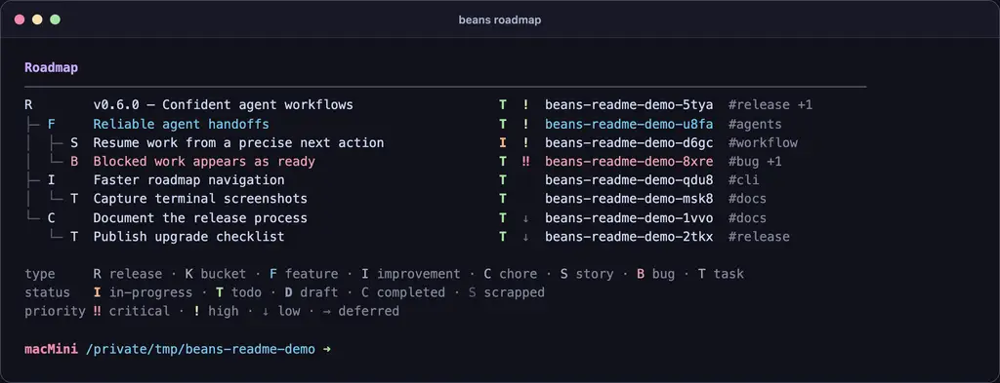
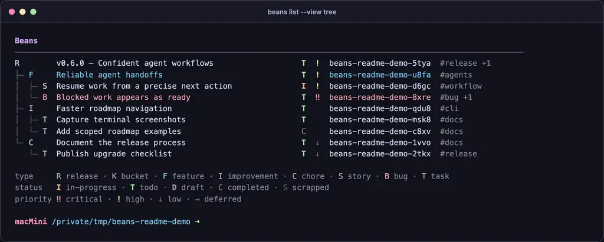
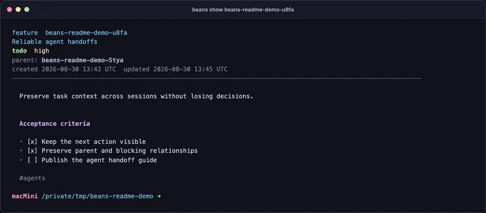
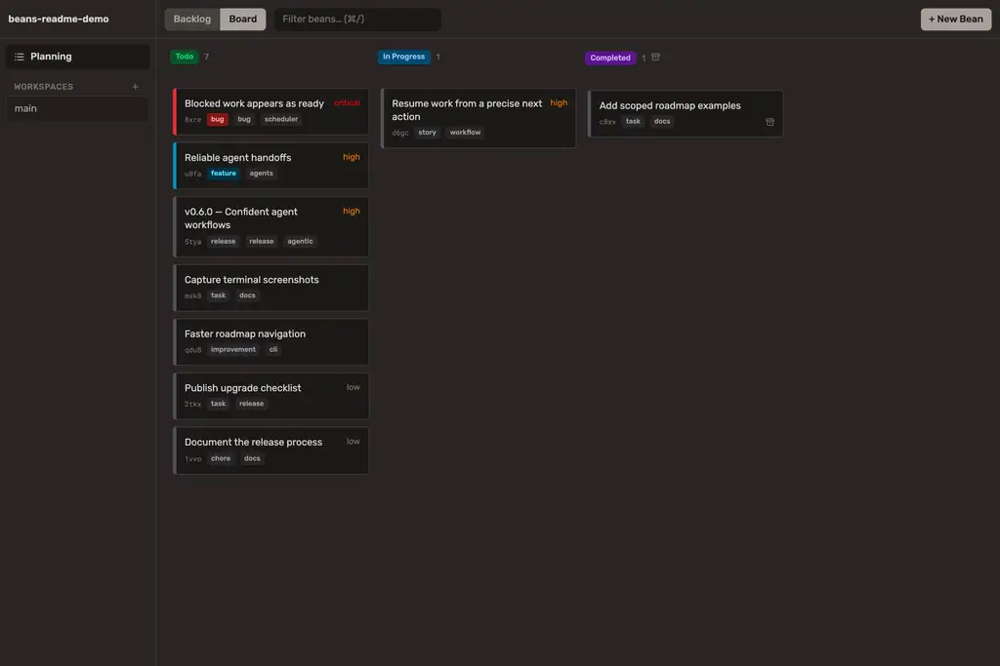

# beans

[](LICENSE)
[](https://go.dev/)

**A file-based issue tracker for developers, product teams, and AI coding agents.**

Beans stores work as Markdown files beside the code it describes. Humans, scripts, and coding agents share one Git-versioned source of truth instead of synchronizing a second task system.

This repository is an actively maintained independent fork of [hmans/beans](https://github.com/hmans/beans). It preserves the original local-first, agent-first idea and extends it for richer planning models, safer automation, and presentation-ready terminal workflows.



[Install](#installation) · [Quick start](#quick-start) · [Choose a profile](#choose-a-project-profile) · [Browse the documentation](wiki/index.md)

## Why this fork

Hannes' original beans project established the core idea: issues should be plain files that live with the repository and remain equally accessible to people and coding agents. This fork builds on that Apache-2.0 codebase with clear attribution to [hmans/beans](https://github.com/hmans/beans).

Real product work needed more than a flat task loop. This continuation adds configurable project profiles, richer planning types, scoped roadmaps, consistent terminal rendering, batch lifecycle commands, ordering and rename workflows, completion policies, worktree-aware storage, structured automation interfaces, and dedicated browser and terminal applications.

The goal is not to turn beans into a hosted project-management platform. Beans remains a small, inspectable data and workflow layer that composes with Git, shells, editors, coding agents, and optional user interfaces.

[Read the fork lineage](wiki/fork-lineage.md) · [Review compatibility and upgrading](wiki/compatibility-and-upgrading.md)

## Feature overview

### Markdown-native issue tracking

- Store each bean as a Markdown file with structured YAML front matter.
- Review task changes with the same Git tools used for code.
- Keep active work and archived project memory readable without a service or proprietary export.
- Configure types, statuses, priorities, display rules, and lifecycle policies per repository.

### Planning that fits the project

- Select a bundled `classic`, `todo`, `simple`, or `complex` profile at initialization.
- Model milestones or releases, thematic work, executable stories and tasks, bugs, and roadmap-excluded buckets.
- Connect work through parent, child, blocking, and blocked-by relationships.
- Order siblings explicitly without rewriting the complete store.

### Human-readable terminal views

- Render `list`, `milestones`, and `roadmap` as trees or tables with a consistent visual language.
- Switch roadmap output between terminal presentation and portable Markdown.
- Scope roadmaps and progress reports to the part of the hierarchy that matters now.
- Preserve machine-readable JSON modes for scripts and agents.

| Hierarchical list | Bean detail |
| --- | --- |
|  |  |

### Agent-native workflows

- Run `beans prime` to give a coding agent the current project's types, statuses, relationships, policies, and command contract.
- Use `beans list --ready` or `beans next` to select actionable work rather than merely open work.
- Query only the required fields through GraphQL and consume stable JSON output where supported.
- Validate configuration, links, front matter, and policies with `beans check` before automation proceeds.

### Complete work lifecycle

- Create and inspect work with `create`, `list`, `show`, and `next`.
- Move work through `start`, `complete`, `scrap`, and `archive`.
- Organize work with `update`, `tag`, `order`, and cascading `rename` modes.
- Report plans and outcomes with `roadmap`, `milestones`, `progress`, and `graph`.

[Explore every capability](wiki/feature-overview.md) · [Open the full command index](wiki/commands/index.md)

## Choose a project profile

Profiles are expanded into the repository's `.beans.yml` when `beans init --profile` runs. Later releases do not silently replace that explicit project configuration.

### `classic`

- **Existing beans migration:** retain the original `milestone → epic → feature → task/bug` hierarchy when adopting the fork.
- **Milestone-driven software delivery:** organize checkpoints into thematic epics, user-facing features, and executable work.

### `todo`

- **Markdown todo list:** track a flat set of tasks without planning containers or hierarchy overhead.
- **AI agent backlog:** give a coding agent a small, unambiguous queue grouped through tags.

### `simple`

- **Small project roadmap:** plan milestones while keeping possible future work in roadmap-excluded buckets.
- **Feature and bug tracking:** separate thematic epics and user-facing features from executable tasks and defects.

### `complex`

- **Release planning for product teams:** group everything that ships together under an explicit release.
- **Customer-value prioritization:** distinguish new features, visible improvements, internal chores, demonstrable stories, bugs, and tasks.

[Compare exact profile hierarchies and use cases](wiki/project-profiles.md)

## Installation

The fork publishes no downloadable release artifacts yet. Build the checkout with the repository's `mise` pipeline, which generates the frontend assets required by the embedded web UI and stamps all three binaries with version metadata.

````sh
git clone https://github.com/xRiErOS/beans.git
cd beans

mise install
mise run setup
mise run build

install -d "$HOME/.local/bin"
install -m 755 beans beans-serve beans-tui "$HOME/.local/bin/"
export PATH="$HOME/.local/bin:$PATH"

beans version
````

The repository currently keeps the historical `github.com/hmans/beans` Go module path. Consequently, `go install github.com/xRiErOS/beans/cmd/beans@latest` is not a valid fork installation command.

[Installation details and prerequisites](wiki/installation.md)

## Quick start

Initialize a disposable project with the smallest profile and create the first ready task:

````sh
mkdir beans-demo
cd beans-demo

beans init --profile todo
beans create "Ship the first documented change" --type task --priority high --status todo
beans list --ready
beans next
````

Beans creates `.beans.yml` plus a `.beans/` directory. Commit both with the repository so task history and code history travel together.

For a hierarchical roadmap, initialize `simple` or `complex`, create top-level planning containers, and connect executable work with `--parent`.

[Follow the complete hierarchy-to-roadmap tutorial](wiki/quick-start.md)

## Use beans with coding agents

The smallest portable integration is a repository instruction that makes the installed binary describe itself and the current project:

````markdown
Before managing project work, run `beans prime` and follow its project-specific instructions.
````

`beans prime` is preferable to a copied command manual because its output reflects the repository's configured types, statuses, priorities, relationships, and completion policies. Agents can then use natural-language requests while operating through exact CLI or GraphQL contracts.

Examples of useful requests:

````text
Inspect the ready beans and recommend the highest-value next action.

Create a bug for the failure you found, relate it to the affected feature, and mark it blocked by the root-cause task.

Summarize progress for the current release and identify incomplete descendants.
````

[Configure Claude Code, OpenCode, and generic agents](wiki/agent-integration.md) · [Read the data model](wiki/data-model.md)

## Browser workspace with `beans-serve`

`beans-serve` runs the optional planning workspace and GraphQL service over the same `.beans/` store used by the CLI. The browser offers backlog, board, and workspace views without introducing a second database.

````sh
beans-serve --beans-path .beans
````



Network binding, CORS, routes, and authentication posture matter before exposing the service beyond a local machine.

[Configure the Web UI and API](wiki/web-ui-and-api.md)

## Terminal interfaces

The fork still builds the original hmans terminal UI as the separate `beans-tui` compatibility binary. Active UI development does not continue inside that original TUI path.

The actively developed companion is [`xRiErOS/beans-tui`](https://github.com/xRiErOS/beans-tui), launched as `bt`: a separate keyboard-first, mouse-friendly Product Owner cockpit built on beans as its data layer. It adds a multi-repository lobby, tree and detail navigation, backlog workflows, search, filters, and full mutation support while beans remains the source of truth.

[Understand the two TUI paths](wiki/tui-companion.md) · [Review all separate binaries](wiki/commands/separate-binaries.md)

## Full feature reference

The reference is grouped by user intent instead of reproducing one long `beans --help` block:

- [Project setup](wiki/commands/project-setup.md): `init`, `path`, `prime`, `version`, `help`, `completion`.
- [Inspection and search](wiki/commands/inspection-and-search.md): `list`, `show`, `next`.
- [Lifecycle](wiki/commands/lifecycle.md): `create`, `start`, `complete`, `scrap`, `archive`, `delete`.
- [Organization and relationships](wiki/commands/organization-and-relations.md): `update`, `tag`, `order`, `rename`.
- [Planning and reporting](wiki/commands/planning-and-reporting.md): `roadmap`, `milestones`, `progress`, `graph`.
- [Querying and automation](wiki/commands/querying-and-automation.md): `graphql`, JSON output, and structured errors.
- [Validation and maintenance](wiki/commands/validation-and-maintenance.md): `check`, integrity rules, and policies.
- [Separate applications](wiki/commands/separate-binaries.md): `beans-serve` and `beans-tui`.

The installed binary remains authoritative for version-specific options:

````sh
beans --help
beans <command> --help
beans prime
````

## Documentation

- [Documentation index](wiki/index.md) — route to every guide and reference page.
- [Configuration reference](wiki/configuration.md) — stores, anchors, profiles, custom types, display, and policies.
- [Data model and file format](wiki/data-model.md) — front matter, bodies, IDs, relationships, order, and archive.
- [Compatibility and upgrading](wiki/compatibility-and-upgrading.md) — assess changes and migrate deliberately.
- [Troubleshooting](wiki/troubleshooting.md) — diagnose store discovery, ready work, policies, configuration, and server startup.

## Project status

This is an actively maintained independent continuation of `hmans/beans`. Features and file-format contracts may still evolve; review the fork's commit history and compatibility guide before upgrading a shared store.

Focused pull requests are welcome at [xRiErOS/beans](https://github.com/xRiErOS/beans). Include the observed behavior, expected behavior, beans version, and smallest reproducible store shape.

## Acknowledgements

Beans was created by [Hannes Müller](https://github.com/hmans) in [hmans/beans](https://github.com/hmans/beans). This fork is possible because that work was released under the Apache License 2.0.

## License

Licensed under the [Apache License 2.0](LICENSE).
